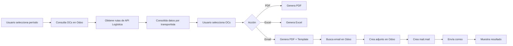

# 📄 Sistema de Proformas de Fletes - Documentación

## 📊 Descripción General

Sistema automatizado para generar y enviar proformas consolidadas de servicios de flete a transportistas. Integra datos de Odoo (OCs) con el sistema de logística (rutas, kms, kilos) para crear documentos profesionales en PDF con envío automático por correo electrónico.

---

## 🎯 Funcionalidades Principales

### ✅ Generación de Documentos
1. **PDF Consolidado por Transportista**
   - Tabla detallada con todas las OCs del período
   - Información de rutas, kilómetros, kilos transportados
   - Costo total y costo por kilómetro
   - Tipo de camión utilizado
   - Totales consolidados

2. **Excel Consolidado**
   - Formato similar al PDF
   - Múltiples hojas por transportista
   - Fácil de importar a otros sistemas

### 📧 Envío Automatizado de Correos
- Template profesional HTML responsive
- Adjunto automático del PDF
- Registro en Odoo (ir.attachment)
- Validación de emails de transportistas
- Logs de envío y errores

---

## 📨 Template de Correo Electrónico

### Características del Template Mejorado

**Diseño Visual:**
- ✨ Header con gradiente azul corporativo (#1f4788 → #2c5aa0)
- 📊 Resumen visual con items destacados
- 💰 Caja especial para monto total
- ⚠️ Aviso destacado para adjuntos
- 📱 Diseño responsive para móviles

**Información Incluida:**
- Saludo personalizado con nombre del transportista
- Período de la proforma
- Resumen ejecutivo:
  - Cantidad de OCs
  - Kilómetros totales
  - Carga total transportada
  - Costo promedio por kilómetro
  - Monto total destacado
- Lista detallada del contenido del PDF
- Información de contacto completa (email + teléfono)
- Footer corporativo con disclaimer

**Estructura HTML:**
```
📧 Correo Electrónico
├── Header Corporativo (gradiente azul)
├── Saludo Personalizado
├── Mensaje Introductorio
├── Resumen del Período (caja destacada)
│   ├── Cantidad de OCs
│   ├── Kilómetros totales
│   ├── Carga transportada
│   ├── Costo por kilómetro
│   └── Monto Total (destacado)
├── Aviso de Adjunto (amarillo destacado)
├── Lista de Contenido del PDF
├── Información de Contacto
├── Mensaje de Cierre
└── Footer Corporativo
```

---

## 📄 Estructura del PDF

### Header
- Título: "PROFORMA CONSOLIDADA DE FLETES"
- Período: Fecha desde - Fecha hasta
- Timestamp de generación

### Contenido por Transportista
- Nombre del transportista (destacado)
- Tabla con columnas:
  - OC
  - Fecha
  - Ruta
  - Kms
  - Kilos
  - Costo
  - $/km
  - Tipo Camión

### Footer de Tabla
- Fila de totales (destacada)
- Resumen: Total OCs | Total Kms | Total Kilos

### Diseño
- Tamaño: A4
- Colores corporativos: #1f4788, #4a90e2
- Fuente: Helvetica
- Márgenes: 0.5 pulgadas

---

## 🔧 Configuración Técnica

### Archivos del Sistema

```
proyectos/
├── pages/
│   └── recepciones/
│       ├── tab_proforma_consolidada.py    # Tab principal en Streamlit
│       └── email_templates.py             # Templates de correo
└── scripts/
    └── transportes/
        ├── test_proforma_email.py         # Script de prueba PDF
        └── test_email_templates.py        # Script comparación templates
```

### Dependencias

**Python Packages:**
```python
streamlit
pandas
xmlrpc.client
reportlab  # Para generación de PDF
openpyxl   # Para generación de Excel
requests   # Para API de logística
```

**APIs Externas:**
- API Logística Rutas: `https://riofuturoprocesos.com/api/logistica/rutas`
- API Logística Costes: `https://riofuturoprocesos.com/api/logistica/db/coste-rutas`

### Conexión Odoo
```python
URL = 'https://riofuturo.server98c6e.oerpondemand.net'
DB = 'riofuturo-master'
```

---

## 📊 Flujo de Datos



---

## 🎨 Datos de Contacto Configurados

**Email de Remitente:**
- `finanzas@riofuturo.cl`

**Teléfono de Contacto:**
- `+56 2 2345 6789`

**Nota:** Estos datos se pueden modificar en el archivo `email_templates.py`

---

## 🧪 Testing y Validación

### Scripts de Prueba Disponibles

1. **test_proforma_email.py**
   - Genera PDF de ejemplo con datos de prueba
   - Genera HTML del template actual
   - Muestra resumen del correo que se enviaría

2. **test_email_templates.py**
   - Compara template actual vs mejorado
   - Genera archivos HTML lado a lado
   - Crea página de comparación visual

### Cómo Probar

```powershell
# Generar ejemplos de PDF y email
cd "c:\new\RIO FUTURO\DASHBOARD\proyectos\scripts\transportes"
python test_proforma_email.py

# Comparar templates
python test_email_templates.py

# Abre los archivos .html generados para ver el resultado
```

---

## 📋 Criterios de Selección de OCs

**Filtros aplicados:**
```python
domain = [
    ('x_studio_categora_de_producto', '=', 'SERVICIOS'),
    ('x_studio_selection_field_yUNPd', 'ilike', 'TRANSPORTES'),
    ('state', 'in', ['draft', 'sent', 'to approve', 'purchase', 'done']),
    ('date_order', '>=', fecha_desde),
    ('date_order', '<=', fecha_hasta)
]
```

**Estados incluidos:**
- `draft` - Borrador
- `sent` - Enviada
- `to approve` - Por aprobar
- `purchase` - Aprobada
- `done` - Completada

---

## 🔐 Seguridad y Permisos

**Acceso al Tab:**
- Requiere permiso: `recepciones.proforma_fletes`
- Configurado en: `data/permissions.json`

**Validaciones:**
- Verifica que el transportista tenga email configurado en Odoo
- Valida que existan OCs en el período seleccionado
- Maneja errores de envío y los registra

---

## 📈 Métricas Mostradas

Para cada transportista se calcula:

1. **Cantidad de OCs** - Número de órdenes de compra
2. **Kilómetros Totales** - Suma de kms de todas las rutas
3. **Kilos Totales** - Suma de carga transportada
4. **Costo Total** - Suma de costos de todas las OCs
5. **Costo Promedio por Km** - Total Costo / Total Kms

---

## 🚀 Uso del Sistema

### Desde el Dashboard

1. **Acceder al Tab**
   - Navega a: Recepciones → 📄 Proforma Consolidada

2. **Seleccionar Período**
   - Fecha Desde: Primer día del período
   - Fecha Hasta: Último día del período

3. **Filtrar Transportistas**
   - Multiselect para elegir transportistas específicos
   - Por defecto muestra todos

4. **Seleccionar OCs**
   - Marca checkbox "Sel" en las OCs deseadas
   - Visualiza resumen de seleccionados

5. **Generar/Enviar**
   - **📄 Generar Proforma PDF**: Descarga PDF
   - **📊 Generar Proforma Excel**: Descarga Excel
   - **📧 Enviar por Correo**: Envía a cada transportista

---

## ⚠️ Troubleshooting

### Problemas Comunes

**1. No se envía el correo**
- ✅ Verificar que el transportista tenga email en Odoo
- ✅ Revisar logs en Odoo → Configuración → Técnico → Email → Emails

**2. No aparecen OCs**
- ✅ Verificar que las OCs estén confirmadas
- ✅ Revisar que sean de categoría SERVICIOS/TRANSPORTES
- ✅ Confirmar que estén en el rango de fechas

**3. Datos de rutas incorrectos**
- ✅ Verificar que la API de logística esté disponible
- ✅ Confirmar que las rutas tengan purchase_order_name asignado

**4. Error al generar PDF**
- ✅ Verificar que reportlab esté instalado
- ✅ Revisar que los datos no tengan caracteres especiales problemáticos

---

## 🔄 Mejoras Futuras Sugeridas

### Automatización Programada
- [ ] Crear cron job para envío mensual automático
- [ ] Scheduler en Windows Task Scheduler
- [ ] Notificaciones de envíos exitosos/fallidos

### Funcionalidades Adicionales
- [ ] Firma digital del PDF
- [ ] Múltiples idiomas (español/inglés)
- [ ] Exportar a diferentes formatos (Word, CSV)
- [ ] Dashboard de métricas de fletes
- [ ] Comparativo mes a mes

### Mejoras Técnicas
- [ ] Cache de rutas de logística
- [ ] Procesamiento asíncrono de PDFs
- [ ] Retry automático en fallos de envío
- [ ] Logs estructurados en base de datos

---

## 📞 Soporte

Para consultas o problemas con el sistema:
- **Email**: finanzas@riofuturo.cl
- **Teléfono**: +56 2 2345 6789
- **Documentación**: Este archivo

---

**Última actualización**: 02/02/2026  
**Versión**: 2.0 (Template Mejorado)  
**Autor**: Sistema de Gestión Río Futuro
